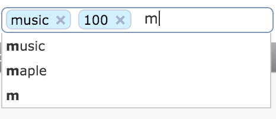
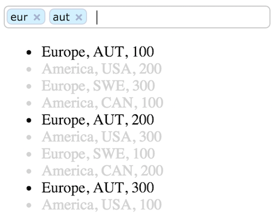

# grid-filter
Filter tool for the grid-component

## Intro

Filter is a tool for _grid-component_ designed to filter a list on entered search terms. Its built with CanJS and StealJS,
and can be used for CanJS stack including DoneJS (http://donejs.com). Component updates isHidden property of list items
to toggle visibility.

The UI part of the filter uses [jQuery Tokeninput](http://loopj.com/jquery-tokeninput/) plugin.

If your grid uses parent-child expandable rows then grid-fiter can also perform a search inside the child rows.
If a match is found in one of the child rows then the parent row with all child rows will be shown.




### Filter logic

Filter will go through the searchable attributes of each item and update isHidden attribute of the item if all of
the searchTerms are found.

Searchable attributes are defined as:
- a list of attributes from the _columns_ config (coma-separated);
- if no _columns_ is defined then all item attributes;
- exclude attributes defined in _exclude-columns_ config;
- if _children-prop_ attribute presents then child items will participate in the search for the parent row; if a match
is found in one of the child rows then the parent row with all child rows will be shown.

## Installation

```
npm install grid-component --save
```

To check out the demo:
- run http server on the root of the project;
- load the demo file in browser _(src/demo/demo.html)_.

## Usage

```html
<grid-filter {(rows)}="rows"></grid-filter>

<grid-filter {(rows)}="rows"
             columns="title,amount"
             {^search-terms}="searchTerms"></grid-filter>

<ul>
 {{#each rows}}
   <li class="{{#if isHidden}}hidden{{/if}}">{{region}}, {{country}}, {{amount}}</li>
 {{/each}}
</ul>
```

### Full grid example
```html
<grid-component {(rows)}="items">

  <div class="grid-tools">

    <grid-filter {(rows)}="rows"></grid-filter>

  </div>

  <table>
    <thead>
      <tr>
        <th ($click)="{sortBy 'title'}">Title {{{sortArrow 'title'}}}</th>
        <th ($click)="{sortBy 'amount'}">Amount {{{sortArrow 'amount'}}}</th>
      </tr>
    </thead>

    <tbody>
      {{#each rows}}
        <tr class="{{^if isVisible}}hidden{{/if}}">
          <td>{{title}}</td>
          <td>{{amount}}</td>
        </tr>
      {{/each}}
    </tbody>
  </table>
</grid-component>
```

## API

- rows: can.List to apply filtering to.
- columns: coma-separated list of columns to filter on. Default is all columns.
- exclude-columns: a list of item attributes to ignore for searching.
- search-terms: a list of search terms entered into filter box.
- children-prop: an attribute to look for child rows. Default is "children".